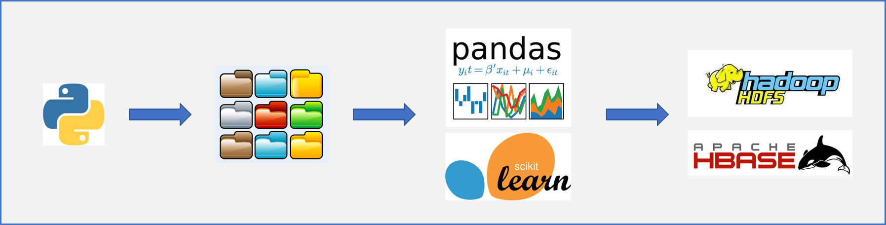
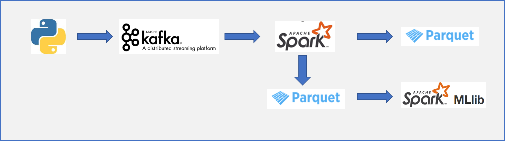

# 使用Structured Streaming消费Kafka数据

由于工作需要，在数据收集方面涉及到多个方面的爬虫数据。之前都是爬虫工程师爬取的数据通过文件方式交付给我们做数据处理再导入到数据库里面。为了降低交互过程中的时间成本，提高效率，我们开始引入流处理的方式来进行。

之前的模式：

<!--  -->
<div>  </div>

使用流处理之后的模式：

<!--  -->
<div>  </div>

## 通过kafka-python包作为数据生产者

首先，需要对爬虫脚本进行改造。原先的写入文件代码部分可以不需要改动，只要对爬取到的数据写入kafka即可(kafka的相关配置可见[上一篇文章]())。

爬虫数据可分为两种，一种是定期的全量数据更新，另一种是增量数据。对于全量数据更新，我们可以在写入kafka中增加爬虫脚本运行的时间戳, 这样通过时间戳来获取到最新一次的爬虫数据。

通过kafka-python包，可以很方便的写入数据到kafka中：

```python
from kafka import KafkaProducer

producer = KafkaProducer(bootstrap_servers=['broker1:port', 'broker2:port', ...])
topic = "crawler"

# 写入kafka的数据需为二进制内容，所以需要进行转化。
# 对于object内容，可先通过json转化成JSON STRING，再用bytes转为二进制。
# spark有from_json函数可以转化JSON STRING
for i in range(100):
    producer.send(topic, bytes('some_message_bytes' + str(i), encoding="utf-8"))
```

参考资料:
* [kafka-python Github项目](https://github.com/dpkp/kafka-python)
* [kafka-python 官方文档](https://kafka-python.readthedocs.io/en/master/index.html)

## Structured Streaming消费Kafka数据

Spark提供了很好的批流统一的API，而最近刚推出的delta也是如此。这样，流处理也能受益于针对Dataframe的优化。

为了使用kafka源，需要加载相应的jar包，所以在启动pyspark或者是通过spark-submit提交时，需要加入相关依赖：

```bash
$ pyspark --packages org.apache.spark:spark-sql-kafka-0-10_2.11:2.4.3
or 
$ spark-submit --packages org.apache.spark:spark-sql-kafka-0-10_2.11:2.4.3
```

使用maven做项目管理时，可以把kafka加入到依赖中

```html
<!-- https://mvnrepository.com/artifact/org.apache.spark/spark-sql-kafka-0-10 -->
<dependency>
    <groupId>org.apache.spark</groupId>
    <artifactId>spark-sql-kafka-0-10_2.12</artifactId>
    <version>2.4.3</version>
    <scope>provided</scope>
</dependency>
```

使用readStream来读入流，指定format为kafka。需要指定kafka的broker以及绑定的主题（可以绑定多个主题    ）。还可以指定offset的位置(有latest, earliest以及具体对每一个topic的每一个分区进行指定)。

```python
df = spark \
  .readStream \
  .format("kafka") \
  .option("kafka.bootstrap.servers", "host1:port1,host2:port2") \
  .option("subscribe", "topic1,topic2") \
  .option("startingOffsets", """{"topic1":{"0":23,"1":-2},"topic2":{"0":-2}}""") \
  .load()
```

这样子，获得到的dataframe就可以使用相关的操作。得到清洗后的数据就可以写入到sink。spark常用的文件格式为parquet，有关parquet的介绍可以参考后面的链接资料。

```python
# 写入到parquet文件
df.writeStream.format("parquet"). \
    option("path", "save_path"). \
    option("checkpointLocation", "save_path/checkpoints"). \
    start()
```

大家可能会困惑Structured Streaming是怎么对kafka的offset进行管理。我们看到读入流的时候要设置offset，那么如果程序中断之后再重启会是怎样呢？这里我们注意到流写入到sink的时候，必须要设置一个checkpointLocaion，Structured Streaming就是在这个目录下来管理offset。如果程序中断之后再重启，虽然在读入流的时候设置的是某一个offset，但是在写入流的时候，如果已经存在了checkpointLocation，那么流会从之前中断的地方继续处理，即读入流对offset的设置只是针对checkpointLocation第一次初始化的时候有效。

在实际使用Structured Streaming的时候，我们也遇到了一些问题：

* 对于长期运行的Structured Streaming程序，如何做到动态使用资源

    首先先评估是否有必要使用长期运行的streaming程序，如果对数据实时性要求没那么高，可以考虑做定期的流任务。如果需要长期运行，可以考虑spark的动态分配资源选项：

    ```bash
    --conf spark.dynamicAllocation.enabled=true \
    --conf spark.dynamicAllocation.initialExecutors=2 \
    --conf spark.dynamicAllocation.minExecutors=2 \
    --conf spark.dynamicAllocation.maxExecutors=5
    ```

* 使用Structured Streaming写入parquet文件，会导致产生很多小的parquet文件，这样子对HDFS的namenode压力比较大

    可以参考[这篇文章](https://evoeftimov.wordpress.com/2017/08/29/spark-streaming-parquet-and-too-many-small-output-files/), 主要的两个解决方案是：

    1. 在Structured Streaming中通过coalesce来减少分区，从而降低写入的parquet文件
    2. 通过运行一个批处理程序来对多个parquet文件重写为指定数量的parquet文件

参考资料:
* [Databricks Structured Streaming案例](https://databricks.com/blog/2017/04/26/processing-data-in-apache-kafka-with-structured-streaming-in-apache-spark-2-2.html)
* [Structured Streaming + Kafka Integration Guide](http://spark.apache.org/docs/latest/structured-streaming-kafka-integration.html)
* [Databricks Parquet介绍](https://databricks.com/glossary/what-is-parquet)