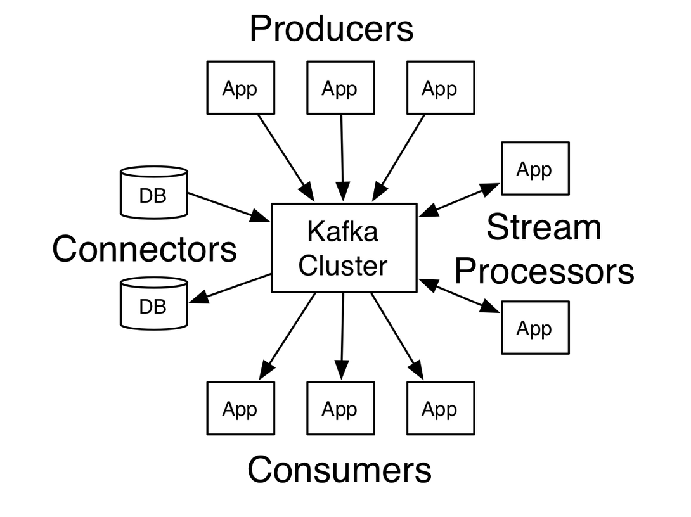
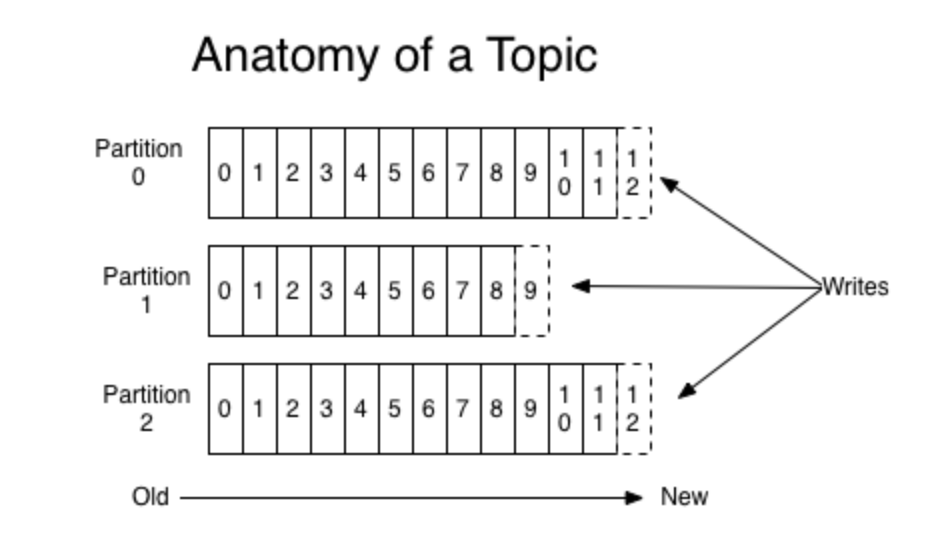
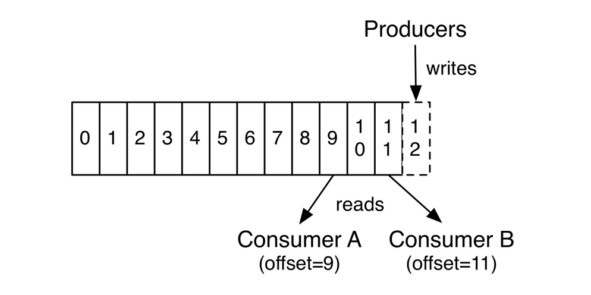

# 快速搭建Kafka服务


搞流处理的话，无论如何是绕不过Kafka的了，还好Kafka是一个概念比较好理解的架构模型。

我觉得官方的这三张图已经很好地把模型结构给阐述清楚了。

1. 发布-订阅模型：实现消息写入与消息读取解耦。Kafka相当于是一个消息缓冲池
    
2. 日志文件顺序结构：Kafka的高吞吐量就是依赖顺序写入（当然还包括了一些零拷贝的内容）；消息可以写入多个分区来实现并行，但是多分区的主题只能保证一个分区内的消息是有序的。
    
3. 消息持久化：消息是以磁盘文件进行保存，可以保存一定的时间。消息可被多次消费，每个消费者记录自己消费的偏移量
    

概念理解了，就可以开始上手实践。（概念理解看起来简单，但是真正要把一个框架的细节研究透需要花费大量的精力）

说到入门，无论是哪个框架的学习，我都是推荐直接看官方文档. 三个原因：1. 最新的版本和代码（基本上版本一更新，文档也会同步） 2. 比较准确（毕竟受这么多人监督） 3. 写的比较精致用心（为了吸引大家来用吧）

可能有人觉得直接看英文压力太大，其实要想成为优秀的程序员，英文是必备技能了，所以咬咬牙还是硬啃吧，回头你会发现，其实英文文档看起来还是挺简单的（起码比论文简单多了）。

接下来的代码主要来自[官方文档](http://kafka.apache.org/quickstart)

1. 下载代码，解压缩

    ```
    > tar -xzf kafka_2.12-2.2.0.tgz
    > cd kafka_2.12-2.2.0
    ```

    解压后，我一般会在.bashrc配置文件中加入以下两行代码：
    ```bash
    export KAFKA_HOME=/path/to/kafka 
    export PATH=$KAFKA_HOME/bin:$PATH 
    ```
    
2. 启动服务

    Kafka是通过zookeeper来对broker(即消息具体负责人)进行管理， 需启动zookeeper集群。若已有zookeeper集群，可直接使用。同时Kafka源码包里也自带zookeeper
    ```
    # 加--daemon选项可实现后台运行守护进程 
    > bin/zookeeper-server-start.sh config/zookeeper.properties
    ```

    broker服务是真正处理消息的进程，他包括响应生产者和消费者请求，同时也负责本broker内的分区副本同步等工作。

    ```
    # 同样，加--daemon选项可实现后台运行守护进程 
    bin/kafka-server-start.sh config/server.properties
    ```

3. 主题创建

    Kafka提供了一些工具来进行主题管理工作, 需指定broker服务的ip和端口（默认9092）

    ```
    # 创建主题
    > bin/kafka-topics.sh --create --bootstrap-server localhost:9092 \
    --replication-factor 1 --partitions 1 --topic test

    # 判断主题是否成功创建
    > bin/kafka-topics.sh --list --bootstrap-server localhost:9092
    ```

4. 测试是否可正常写入和消费

    使用Kafka自带的生产者工具
    ```
    > bin/kafka-console-producer.sh --broker-list localhost:9092 --topic test
    ```

    在打开一个终端，使用Kafka自带的消费者工具
    ```
    > bin/kafka-console-consumer.sh --bootstrap-server localhost:9092 \
    --topic test --from-beginning
    ```

    此时，如果在生产者终端输入内容，然后在消费者终端能看到数据，那就证明Kafka在正常运作

关于搭建一个稳健的用于生产环境Kafka集群还需要更多的知识和考虑更多的业务场景。

