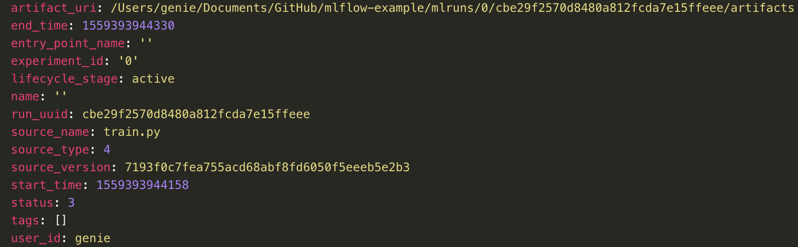

# MLflow Tracking 模块解析

MLflow Example Github地址 [https://github.com/mlflow/mlflow-example](https://github.com/mlflow/mlflow-example)

大家在试用MLflow的时候可以用上面这个github代码来做演示。

## MLflow tracking 功能 

MLflow tracking提供了两大模块的功能：执行记录的api以及进行记录查看的UI界面。

记录的内容可以包括： 
* 代码版本
* 运行的起始和结束时间
* 源码文件名
* 参数parameter
* 指标metric
* 文件artifact

那么这些记录可以保存在什么地方？目前提供以下保存方式：
* 本地文件(`file:/my/local/dir`)
* 数据库(`db_type://<user_name>:<password>@<host>:<port>/<database_name>`)
* Http服务(`https://<my-server>:<port>`)
* Databricks平台

MLflow tracking UI 界面如下图所示


## MLflow tracking api 使用

对于python来说，首先需要安装mlflow模块，直接可以pip安装 `$ pip install mlflow` 即可

使用tracking功能需要理解在tracking里的几个概念：跟踪位置(tracking_uri)、实验（experiment）、运行（run）、参数（parameter）、指标（metric）以及文件（artifact）

* 跟踪位置(tracking_uri): 即所有记录数据的保存位置
* 实验名(experiment): 相当于项目名，所有的调参都是针对这个实验。默认为Default
* 运行(run): 每次调参的运行记录，一个随机的hash值
* 参数(parameter): 每次调参所记录的参数，记录为{key: value}的形式， 每次run不要求key都一样
* 指标(metric): 记录每次调参之后的指标结果，记录为{key: value}的形式，value必须为数值型
* 文件(artifact): 记录文件

以下为代码案例：

进入mlflow-example文件夹， 运行train.py脚本`$ python train.py`, 就会发现当前目录下出现一个mlruns文件夹。

MLflow tracking主要api解析：

```python
# 指定记录存储位置，默认为当前路径的./mlruns文件夹。
# 若配置过MLFLOW_TRACKING_URI环境变量，则使用该参数，HttpServer的方式在UI部分说明
mlflow.set_tracking_uri("http://127.0.0.1:5000")

# 创建和设置实验。其实只需要设置实验即可，若实验不存在则会自动创建。
mlflow.create_experiment("experiment_name")
mlflow.set_experiment("experiment_name")

# start_run与end_run为一对函数（类似文件IO的open和close）
# 使用with方式可避免忘记结束run
with mlflow.start_run():
    lr = ElasticNet(alpha=alpha, l1_ratio=l1_ratio, random_state=42)
    lr.fit(train_x, train_y)

    predicted_qualities = lr.predict(test_x)

    (rmse, mae, r2) = eval_metrics(test_y, predicted_qualities)

    print("Elasticnet model (alpha=%f, l1_ratio=%f):" % (alpha, l1_ratio))
    print("  RMSE: %s" % rmse)
    print("  MAE: %s" % mae)
    print("  R2: %s" % r2)

    # 记录参数使用log_param， 记录指标使用log_metric
    mlflow.log_param("alpha", alpha)
    mlflow.log_param("l1_ratio", l1_ratio)
    mlflow.log_metric("rmse", rmse)
    mlflow.log_metric("r2", r2)
    mlflow.log_metric("mae", mae)

    # tracking 还有保存模型功能，具体保存的内容在MLflow models会涉及
    # 注意这里第一个参数是模型obj， 第二个参数为目录名
    mlflow.sklearn.log_model(lr, "model")
```

## MLflow tracking ui 使用

安装MLflow后，我们就可以使用一些特定的命令，其中就包括启动MLflow tracking UI服务的功能。

通过命令`$ mlflow ui --help`，我们可以了解tracking ui的用法

在mlflow-example目录中，当前存在mlruns目录，即可直接使用命令`$ mlflow ui`启动UI服务，然后在浏览器访问本地ip和5000端口([http://localhost:5000](http://localhost:5000))即可查看tracking ui界面。

通过tracking ui界面的交互，可以继续加以探索：包括参数记录的导出，对比，增加一些note等功能。

当然，我们可以通过`--backend-store-uri`指定记录存储位置, `-p`指定特定端口, `-h`为0.0.0.0使得其他机器也能访问该ip的tracking ui服务

通过在一台机器上启动这么一个后台服务，则其他机器在使用tracking功能时，可以指定该tracking_uri（http://server_ip:port），这样所有的用户都使用同一个服务来进行实验记录。

需要注意的是，如果没有指定`--default-artifact-root`参数，则默认是在mlruns内。但是当使用某一台机器作为远程的tracking ui server， 一般的参数数据都会被记录在该服务器上，除了文件artifact和模型数据（与服务器上的同一路径名的本地文件系统）。原因在于项目设计的时候认为大的数据文件应该有一个统一的管理位置。所以需要指定`--default-artifact-root`到一个共享文件系统。目前支持的文件系统有：S3, FTP, NFTP, NFS...后续还会支持HDFS。 [可参考tracking的文档](https://mlflow.org/docs/latest/tracking.html#storage)

## MLflow tracking 文件结构深入分析

至此，我们已经了解了如果使用tracking api以及ui来记录跟踪参数。那么关于其中生成的mlruns目录是怎么组织记录数据呢？

首先先看一下目录结构:
<div>  </div>

mlruns下的第一层的目录为id号，表示实验的id。那么实验名字在哪体现？打开该实验目录下的元数据文件meta.yaml。我们看到这里对该实验的一些描述，主要是实验名称、实验序号（与目录名匹配）、artifact的位置（在真实场景中，artifact目录与参数记录是分离的）

<div>  </div>

接下来可以看到实验下面的run目录，由于我这里只跑了一次，所以只有一个run_id目录，多次调参后，该层目录会逐渐变多, 与实验一样，run_id也有一个元数据文件meta.yaml来对run_id进行描述。run_id目录下，可以看到有artifact, metrics, parameters, tags文件夹，相关的数据将记录在这些文件夹内。

<div>  </div>

展开metrics, params, tags目录，我们看到之前在脚本中记录的参数，记录为一个key-value对。而在真实数据中，key为文件名，而value则为文件内容。其中metric的文件内容里面，还增加了时间戳

<div>  </div>

artifact部分的内容主要涉及的MLflow model部分，会在后续的分享内容里体现。