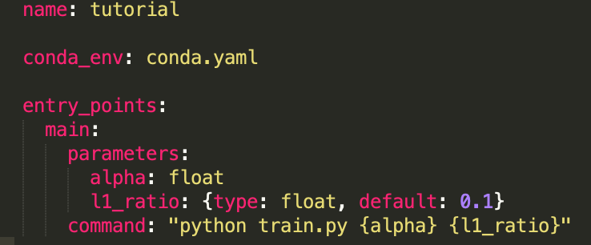
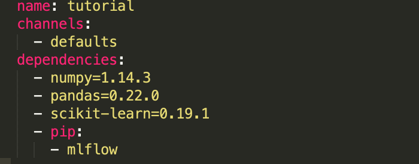
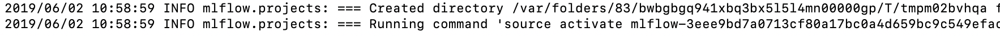

# MLflow Projects 模块解析

通过Tracking模块，我们已经能够对参数进行管理。接下来我们通过Projects模块来实现可复用的代码以及为后续生产部署做准备。

从[文档](https://www.mlflow.org/docs/latest/projects.html)可以看到Projects模块的定义：这是一种基于约定俗成的规则来对代码进行管理的格式。 提供了api和命令工具来串接项目到一个工作流程中。

接下来，我们来探索这个约定俗成的规则以及如何复现其他项目的代码。

## MLflow Projects 格式管理

以mlflow-example为例，我们发现这个文件夹只是比普通的代码目录多了两个文件： MLproject和conda.yaml.

#### MLproject: 这个文件定义了该项目的主要信息，并且这个文件名必须为MLproject（区分大小写）

可以看到这里面定义了几个关键信息，这些是需要项目开发人员进行定义：

* 项目名称
* 环境依赖： 可以是python依赖(conda_env)或者是镜像依赖(docker_env)
* 入口： 可以有多个入口
    * 入口名1
        * 提供的参数: 多个参数，需指定类型(float, path, string, uri)，可指定默认值
        * 该入口执行的命令(python 或者 bash shell)
    * ...

#### conda.yaml: 环境依赖文件

之前经常出现一种情况，在复现github代码的过程中遇到环境依赖问题，很多人在分享代码的时候没有把相关的依赖贴出来，而现在很多框架的发展很快，导致旧代码不兼容而无法复现。

当然，MLflow Projects要解决这个问题就必然需要考虑环境依赖问题，所以在定义MLproject文件的时候必须指定依赖文件。这里以python依赖为例，导出依赖到yaml文件，该文件名没有要求，只要跟MLproject文件保持一致即可。

当然，如果依赖很多的时候，我们不可能手动把所有包名都加入文件，这时候可以使用conda的依赖生成命令：

`$ conda env export --name=environment_name > environment.yaml`

由于该命令是把整个虚拟环境的所有包都导出，建议每个项目都在单独的虚拟环境下开发，保证最小的依赖。

关于docker环境依赖可以查看[文档](https://www.mlflow.org/docs/latest/projects.html)

## MLflow Projects 代码复现

MLflow Projects提供两种复现代码的方式: api和命令行。 两者大同小异，只要理解了具体需要提供的参数即可

命令行方式: `$ mlflow run [options] URI`

具体的参数有：
* 项目目录(URI)： 可以是本地的文件目录，也可以是远程的git项目
* 版本(--version)：如果是用git管理，可以使用版本号来指定
* 入口(--entry-point): 默认为main，如果需要使用其他入口，必须保证在MLproject里有定义
* 参数(--param-list NAME=VALUE): 入口中定义的参数列表，未提供默认参数的必须要在命令中体现
* 部署方式(--mode): 目前只提供local和databricks两种方式
* 依赖环境(--no-conda): 指定之后将不创建虚拟环境，在当前环境下运行程序
* ... (其他可选参数通过`$mlflow run --help`查看)

执行mlflow run命令，通过打印出来的消息，我们可以看到复现代码的流程。首先mlflow会把MLflow Project项目的所有文件拷贝到一个临时文件夹下，同时切换到相应的虚拟环境(如果该虚拟环境还未安装，则会有一个安装过程)。

需要注意一点的是：mlflow run命令也会生成一个mlruns文件夹来记录复现代码的结果，为了保证统一管理，建议是通过设置环境变量MLFLOW_TRACKING_URI，来使得所有项目都汇集在一个mlruns目录下。
