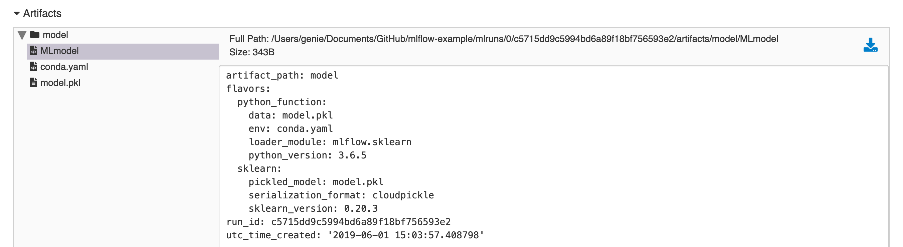
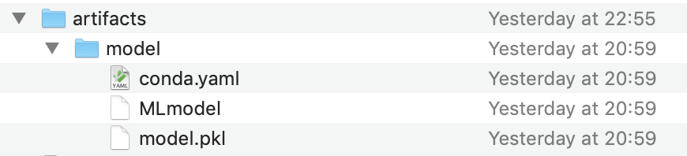
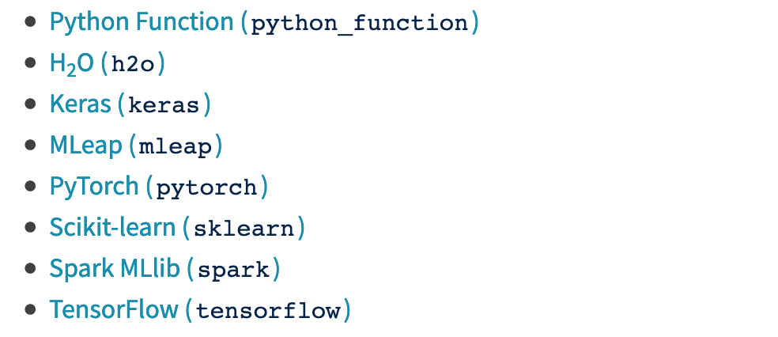

# MLflow Models 模块解析

通过Tracking和Projects模块，我们可以管理记录参数以及整合不同的项目。最后这些训练出来的模型如何做到在线部署或者是做批处理应用，这个需要使用MLflow Models来解决。

同样的，在MLflow Models[相关文档中](https://www.mlflow.org/docs/latest/models.html)， 对Models模块的定义为：这是一套标准格式来对模型结果进行打包，并可以被下游工具(如在线REST API服务和Apache Spark的批处理)所使用。

## MLflow Models 模型保存格式

在前面的Tracking中，我们记录过了模型结果(`mlflow.sklearn.log_model(lr, 'model')`), 所以无论是从UI界面或者mlruns目录的artifact文件夹中，都可以看到生成的数据结果。

这里我们看到三个文件：MLmodel(模型的主要定义), conda.yaml(依赖环境), model.pkl(序列化的模型文件)



<div></div>

MLmodel文件里，最主要的是falvor这个参数，他表示了该模型的类型。目前支持的模型格式如下：

<div></div>

## MLflow Models的模型使用（在线部署和批处理）

一旦模型保存下来，就可以利用模型结果来进行预测或者是在线部署。MLflow Models也是提供了api和命令行两种形式，只要把具体的参数理解了，两种方式相差不大。

* 批处理

    命令行提供了一个predict功能，通过`$ mlflow pyfunc predict --help`, 可以了解需要提供的参数

    执行`$ mlflow pyfunc predict -m model -r run_id -i input_csv` 即可使用run-id得到的模型对input_csv文件的数据进行推断

    另外一种方式是通过mlflow把模型加载成spark_udf，利用udf实现分布式的批处理推断

    ```python
    pyfunc_udf = mlflow.pyfunc.spark_udf(<path-to-model>)
    df = spark_df.withColumn("prediction", pyfunc_udf(<features>))
    ```

* 在线部署

    命令行提供一个serve部署功能，通过`$ mlflow pyfunc serve --help`了解需要提供的参数。

    可以看到serve和predict参数很类似，但是serve需要提供`--host`和`--port`的参数。这样就部署好了在线推断的服务。下面会提到如何使用在线服务

## MLflow Models的服务使用

在上面，我们已经知道如何部署一个在线服务，那么mlflow关于这个REST API的调用是有要求的。

假定我们部署在本地的5001端口上，在调用REST api之前，我们需要构造好uri, data和headers

```python
import requests
import pandas as pd

# 构造需要进行推断的数据
cols = ["fixed acidity","volatile acidity","citric acid","residual sugar","chlorides","free sulfur dioxide", \
        "total sulfur dioxide","density","pH","sulphates","alcohol"]
data = [[7,0.27,0.36,20.7,0.045,45,170,1.001,3,0.45,8.8],
        [6.3,0.3,0.34,1.6,0.049,14,132,0.994,3.3,0.49,9.5]]
model_input = pd.DataFrame(data, columns=cols)

# 指定ip, 端口
url = "http://127.0.0.1:5001/invocations"
# 传递的参数需要从dataframe转化为json格式
req_data = model_input.to_json(orient='split')
# 指定headers参数
headers = {'content-type': 'application/json; format=pandas-split'}

# 使用POST方式调用REST api
respond = requests.request("POST", url, data=req_data, headers=headers)
# 获取返回值
respond.json()
```

至此，我们就可以愉快地通过其他程序和REST api来使用我们的模型进行在线推断了。
