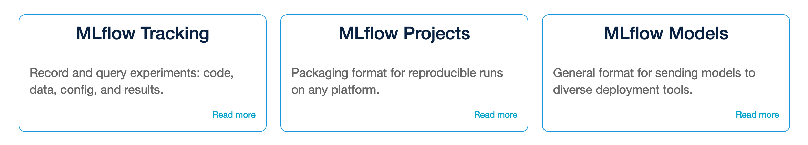
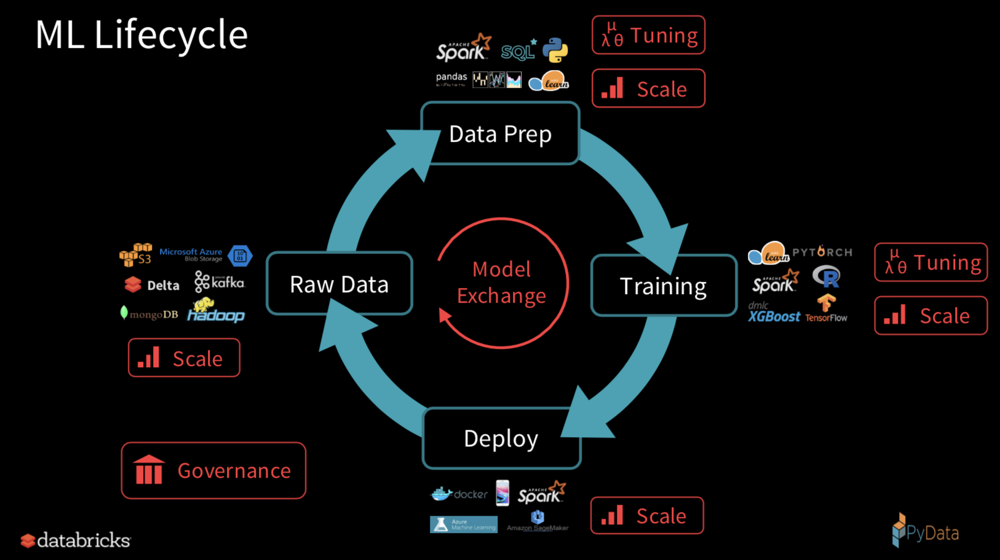

# MLflow 项目总览

  

Github项目地址： [https://github.com/mlflow/mlflow](https://github.com/mlflow/mlflow)

官方网站： [https://www.mlflow.org/](https://www.mlflow.org/)

MLflow 组成模块

从去年6月份databricks公司开源MLflow项目至今，该项目已经从alpha版本迭代到了0.9版本，而在最近的Spark AI Summit 2019峰会上，Spark创始人Matei也公布了正式版本1.0的realease。

1. 什么是MLflow？

    按照官方的字面定义：这是一个管理机器学习生命周期的开源平台。

2. MLflow解决了什么问题？

    首先先从机器学习的生命周期去理解目前行业上的痛点，然后再看怎么通过MLflow来解决。

    机器学习不是一个单向的pipeline，而是一个迭代的循环。其中包括4大部分：数据预处理、模型训练、模型部署、数据更新。

    其中预处理过程和模型训练都涉及到参数的调整；整个ML的过程都涉及到环节之间的配合。

    1. 参数调整的记录问题

        现状：对于参数调整的问题，以往我们都是手工做记录，把对应的参数记载在excel或者其他文件中进行保存。再好一点的话就是通过git进行版本控制，在提交commit的时候把对应的参数记录下来。通过excel记录的数据，我们可以对比不同参数的效果；通过git版本控制，我们可以切换到对应参数的代码版本。但是这一切的工作都费时费力，对于我来说，即使知道记录参数很重要，但是很多时候不会每一次调参都记录一次。

        MLflow的解决方案：如何更好地记录相应的参数和对应参数的到的效果，MLflow通过使用tracking模块的功能，能够把参数、metric效果以及对应的代码版本都记录下来，而这一切的工作量只需要在代码中加上一段使用tracking api的代码即可。后续每次参数的调整都能记录下来。(当然，tracking还有保存模型的功能，这部分内容会在后面的模块分享中提及)

    2. 各环节的配合问题

        现状：在我们公司做开发模型的时候，我们算法这边实现了最小闭环之后，拿给工程组的同事部署。这时候，并不是代码拿过来就可用，而是需要大量的沟通工作、代码改写以及环境的配置（目前机器学习相关的框架很多，不同模型可能使用不同框架），而且很多时候复现的结果也不能完全保证。

        MLflow的解决方案：为了解决各个环节之间的配合问题，MLflow提出了MLflow Project以及MLflow Model这两个概念，这两个都是定义了一套惯例标准，只要你的project或者是model遵循这套配置，你就可以使用mlflow来进行一键式的project复现和模型部署功能，相当于你模型开发者的开发结果直接就可以一键式上线部署，中间不用工程改写代码，不需要环境的配置（具体细节在MLflow Project章节里面详细探讨）

    

有关MLflow三个模块的具体细节我们在其他文章分享。
