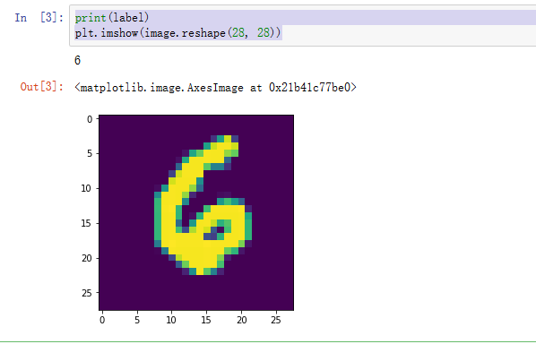
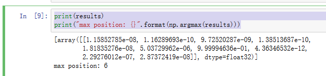

# Paddle 模型保存与加载

前面我们已经通过搭建LeNet模型来识别手写数字MNIST，最终一个epoch训练的模型准确率可以达到97.5%. 接下来我们看如何对模型进行保存以及后续加载模型进行推断。

Paddle提供两种方式的保存和加载模型：

1. 保存整个模型
2. 只保存模型参数

### 整个模型的保存与加载

保存模型使用fluid.io.save_inference_model这个API，参数为：保存路径，输入的Variable名， 需要获取的Variable以及Executor
```python
# 保存参数
save_dirname = "./mnist_model"
fluid.io.save_inference_model(save_dirname, ["img"], [predict], exe, model_filename=None, params_filename=None)
```

加载模型这块比较简单，定义一个Executor，然后使用load_inference_model加载模型，获取program, feed_target_names, fetch_targets, 这三个变量，用于后续的使用
```python
exe = fluid.Executor(fluid.CPUPlace())
path = "./mnist_model"
inference_program, feed_target_names, fetch_targets = fluid.io.load_inference_model       
    (dirname=path, executor=exe)
```

### 参数的保存与加载

第二种方式是只保存模型参数, 只需要指定Executor和参数保存路径即可。

```python
param_path = "./my_paddle_model"
prog = fluid.default_main_program()
fluid.io.save_params(executor=exe, dirname=param_path, main_program=None)
```

通过参数保存方式，在后续的加载中相对会复杂一些。第一步先构造program和executor, 在默认环境下，构造模型结构。然后通过load_parameters方式来把参数加载到executor中。

```python
# 使用加载参数的方式加载
exe = fluid.Executor(fluid.CPUPlace())
param_path = "./my_paddle_model"
inference_program = fluid.default_main_program()

# 定义LetNet网络结构
def LeNet():
    img = fluid.layers.data(name='img', shape=[1, 28, 28], dtype='float32')
    conv1 = fluid.layers.conv2d(input=img, num_filters=20, filter_size=5, stride=2, act="relu")
    conv1 = fluid.layers.batch_norm(conv1)
    conv2 = fluid.layers.conv2d(input=conv1, num_filters=50, filter_size=5, stride=2, act="relu")
    predict = fluid.layers.fc(input=conv2, size=10, act="softmax")
    return predict

predict = LeNet()

fluid.io.load_params(executor=exe, dirname=param_path,
                    main_program=None)
# 为了保证与模型加载使用同样的参数
feed_target_names = ['img']
fetch_targets = [predict]
```

### 模型推断

前面已经通过模型保存，以及后续的模型加载获取到了预训练的模型。接下来是针对测试数据，我们来看这些未被训练过的数据是否能够被模型正确地判断出来。

首先还是加载数据, 在这里我们只选取mnist测试集中的一个来看看
```python
BATCH_SIZE = 64
BUF_SIZE = 256

test_data = paddle.batch(
    paddle.reader.shuffle(mnist.test(), buf_size=BUF_SIZE), 
    batch_size=BATCH_SIZE)

for data in test_data():
    image, label = data[3]
    break
```

先看看我们的image具体图像，以及label的具体数值：
```python
print(label)
plt.imshow(image.reshape(28, 28))
```

<div align=center></div> 

接下来看看模型预测的结果, 可以看到softmax出来的结果数字6的预测是最高的。

```python
results = exe.run(inference_program,
              feed={feed_target_names[0]: image.reshape(-1, 1, 28, 28)},
              fetch_list=fetch_targets)
print(results)
print("max position: {}".format(np.argmax(results)))
```

<div align=center></div> 