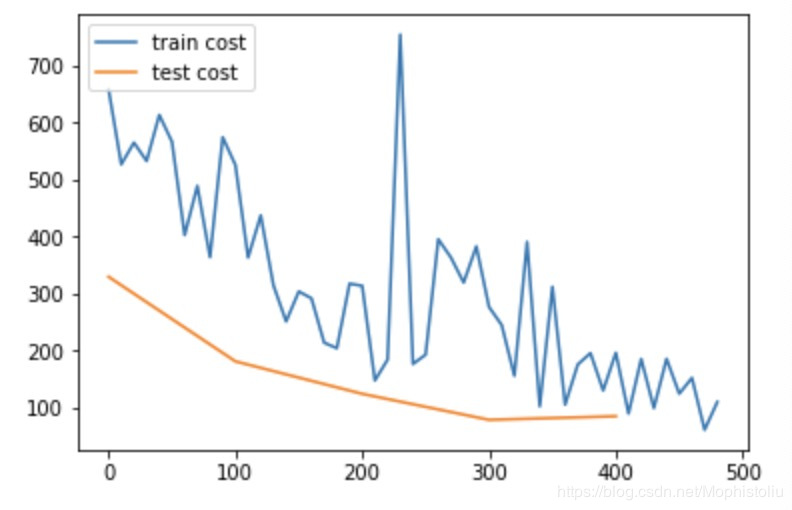

# Paddle的实时画图功能

记得第一次跑Paddle的[官方例子](http://paddlepaddle.org/documentation/docs/zh/1.3/beginners_guide/quick_start/fit_a_line/README.cn.html)时，最让我惊奇的是它能实时地显示train loss和val loss随着训练次数的变化图。

之前用Pytorch都是在训练过程中先打印训练过程的loss，并且把他们保存起来。最后等训练完成再作图。所以在训练完成之前只能看着数字的变化，却无法有一个实时的图形化结果。百度的Paddle给了我一个惊喜。所以抱着如何实现的疑问，我去查看了框架源码，才发现，原来只是一个简单技巧就可以达成这种效果。

首先看看一个例子：
```python
from paddle.utils.plot import Ploter
import numpy as np
%matplotlib inline

train_prompt = "train cost"
test_prompt = "test cost"
plot_prompt = Ploter(train_prompt, test_prompt)

for step in range(10):
    plot_prompt.append(title=train_prompt, step=step, value=0.1-np.random.randn()*step) 
    plot_prompt.plot()
```

下图是官方例子训练出来的图，上述例子只能有个大概的样子

<div>  </div>

这个功能的实现主要是靠paddle.utils.plot里面的Ploter这个类。

```python
class Ploter(object):
    def __init__(self, *args):
        self.__args__ = args
        self.__plot_data__ = {}
        for title in args:
            self.__plot_data__[title] = PlotData()
````
从Ploter类的初始化方法，我们可以看到它接受任意个参数。每个参数会作为一个主题，也就是我们要画图的图标，在我们例子的代码里就是train cost和test cost。Ploter类初始化的时候会维护一个字典__plot_data__, 每个主题作为key，新创建的PlotData类作为对应的value。那么这个PlotData是个什么东西？看一下PlotData类的定义：

```python
class PlotData(object):
    def __init__(self):
        self.step = []
        self.value = []

    def append(self, step, value):
        self.step.append(step)
        self.value.append(value)

    def reset(self):
        self.step = []
        self.value = []
```
非常简单的类结构，维持了两个list分别对应step和value，定义了append和reset方法。这两个方法都是在Ploter内会被调用。

由于不停调用plot多少还是会影响效率，所以在正式训练的时候建议通过设置环境变量来决定是否进行plot. Ploter类中会获取DISABLE_PLOT这个环境变量，如果其为True，则Ploter将不会实时画图。这样子就无需修改我们在测试阶段调用Ploter的plot方法代码了。

```python
    def __init__(self, *args):
        self.__args__ = args
        self.__plot_data__ = {}
        for title in args:
            self.__plot_data__[title] = PlotData()
        self.__disable_plot__ = os.environ.get("DISABLE_PLOT")
        if not self.__plot_is_disabled__():
            import matplotlib.pyplot as plt
            from IPython import display
            self.plt = plt
            self.display = display

    def __plot_is_disabled__(self):
        return self.__disable_plot__ == "True"
```

看到百度Paddle把这个功能增加到框架里面，看来也是遇到过类似的需求：在代码调试阶段进行实时显示loss的变化情况，如果loss没有下降就要回去看看代码哪里有问题了。