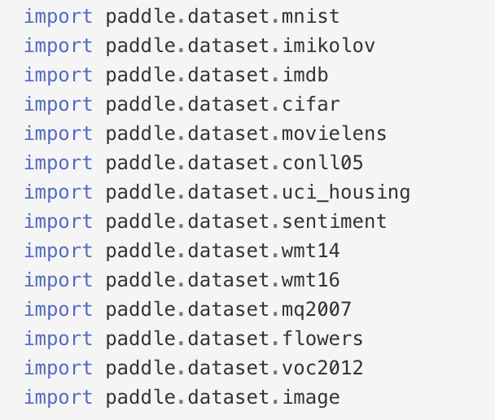
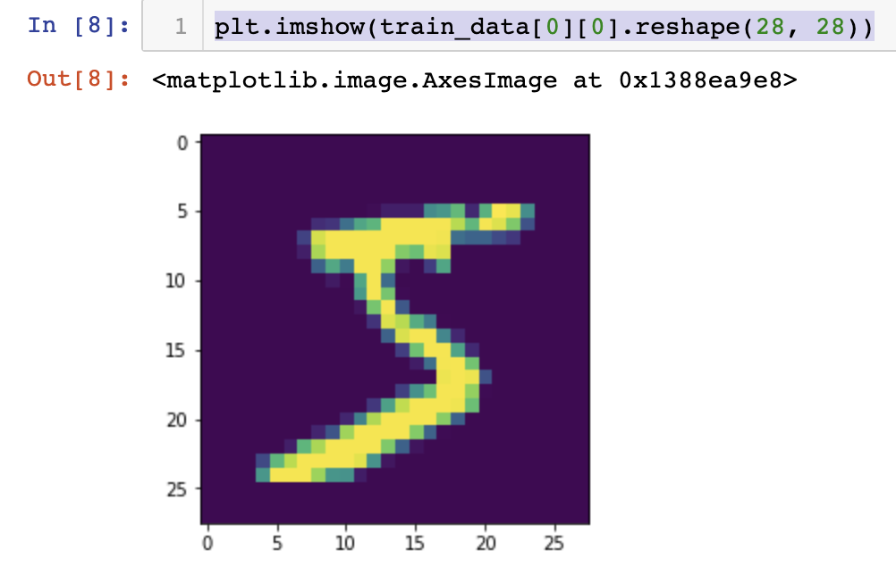

# PaddlePaddle 数据集初探

最近开始使用PaddlePaddle深度学习框架，因为之前有使用过Tensorflow和Pytorch，所以整体感觉上手不难。

具体官方文档以及Github资料如下，可以说最吸引我的地方在于百度为了推广这个框架，把很多主流的模型都官方实现了，同时相关的数据集和预训练模型也提供方便的下载渠道。

* [官方文档](http://paddlepaddle.org/documentation/docs/zh/1.3/beginners_guide/install/index_cn.html)
* [Paddle Github项目](https://github.com/PaddlePaddle/Paddle)
* [Models GitHub项目](https://github.com/PaddlePaddle/models)

刚开始接触Paddle的时候还真的有点不习惯，首先最开始该项目是用python2写的，后续才改成兼容python3，所以有些代码遗留问题需要注意。在python3环境下出现问题的话可以到Github项目提Issue，或者贡献修复代码（个人觉得看代码对自身能力提升很高，可以学习别人优秀的代码能力）

言归正传，本文主要是对Paddle框架的dataset设计理念进行一些解读。

首先，框架本身提供了很多数据集，这块的话没有太大特殊的地方。下图是Paddle代码里面提供的数据集：

<!--  -->
<div>  </div>

查看代码，可以看到默认所有的数据都是直接下载到目录`'~/.cache/paddle/dataset'`, 看了一下原代码，貌似Paddle也不提供参数来指定别的位置（当然你可以改源码或者通过软链接的方式来实现）。 使用方法也很简单，导入对应的数据集，使用其train和test方法获取数据。
```python
import paddle 
import paddle.fluid as fluid
from paddle.dataset import mnist
import matplotlib.pyplot as plt

train_data = mnist.train()
test_data = mnist.test()
```
OK， 最大的差别就在于这个返回的数据，一般其他框架都是直接返回数据，而Paddle对于数据的设计理念不同。由于在使用深度学习框架的时候，一般我们的数据会比较大，如果此时直接加载，1是可能会导致内存不足，2是加载时间过长。所以paddle返回的是一个方法！！！（这个方法的返回值是一个generator！！！）所以第一次接触Paddle的同学都会对其感到不习惯。

我们用一小段代码来查看一下结果：
```python
train_data = list(train_data())
test_data = list(test_data())

print(type(train_data[0]))
print(type(train_data[0][0]))
print(train_data[0][0].shape)
print(train_data[0][1])
plt.imshow(train_data[0][0].reshape(28, 28))
```
输出如下：

    <class 'tuple'>
    <class 'numpy.ndarray'>
    (784,)
    5

<!--  -->
<div>  </div>

所以我们知道返回的generator是一个由tuple组成的，且tuple第一个元素为numpy.ndarray, 第二个元素是一个整数

我们知道一般在模型训练中，对只是对一个batch的数据进行计算，且会对数据进行打乱排序。当然Paddle也提供这些功能：

1. shuffle

    paddle.reader的shuffle函数提供了这个功能，它的第一个参数是从dataset得到的返回generator的函数，第二个参数是每次进行shuffle的数据量。这里的shuffle跟我们日常理解的shuffle还不太一样，它是加载一定数量的数据（我们第二个参数），然后进行shuffle后输出，接着继续进行下一批数据shuffle。如果要全量数据进行shuffle，只要第二个参数大于所有数据总量即可。最后返回的是一个无参函数，函数返回的是一个generator

    ```python
    paddle.reader.shuffle(mnist.train(), buf_size=500)
    ```

2. batch功能

    paddle.batch把数据封装成输出一个一个Batch的形式。第一个参数是无参函数（与dataset和shuffle返回的一样）, 第二个参数是batch的大小。至于batch函数直接放在paddle下面这一层还是挺让我困惑的，我觉得这个函数应该是放在reader里面比较合适。当然啦，这个函数的返回值还是跟前面几个方法一样，都是一个无参函数，其返回值是一个generator。
    ```python
    batch_loader = paddle.batch(mnist.train(), batch_size=10)
    first_batch = list(batch_loader())[0]
    print(type(first_batch))
    print(type(first_batch[0]))
    ``` 
    这次的返回结果证明，batch之后最终数据的是以一个list的方式返回，list大小即为batch大小。

        <class 'list'>
        <class 'tuple'>

看完这三个函数之后，相信大家对Paddle的数据组织形式有了一定了解。可以说Paddle把惰性计算的思想贯穿了整个框架，而且习惯了这种数据组织方式之后也没什么特别难的地方。但是为什么不直接返回generator而是返回无参函数是我不太理解的地方。