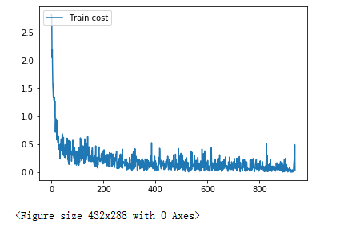
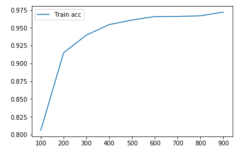

# Paddle使用流程

前面讲了paddle在数据上的设计以及Ploter的实时画图功能。接下来就是看看Paddle怎么实现神经网络的训练。

首先所有神经网络的实现流程无非是：

加载数据 -> 定义网络结构 -> 选择优化器 -> 迭代进行计算优化 -> 保存模型参数以供后续使用。

接下在我们用经典的LeNet模型训练MNIST数据集来演示：

1. 加载数据

	关于数据如果还有不太理解的可以参考之前的Blog[PaddlePaddle 数据集初探](https://blog.csdn.net/Mophistoliu/article/details/89289079)
	
	以下是关于数据加载这块的内容
	```python
    # 准备数据
	BATCH_SIZE = 64
	BUF_SIZE = 256
	
	train_data = paddle.batch(
	    paddle.reader.shuffle(mnist.train(), buf_size=BUF_SIZE), 
	    batch_size=BATCH_SIZE)
	
	test_data = paddle.batch(
	    paddle.reader.shuffle(mnist.test(), buf_size=BUF_SIZE), 
	    batch_size=BATCH_SIZE)
	```

2. 定义网络结构

    关于网络结构定义这块，Paddle更像Tensorflow，会有一个静态图的构造过程，需要定义输入数据层（place_holder）。而Pytorch是动态图，所以不需要考虑这些，这也是Pytorch相对比较容易入手的一个优点。

    在定义网络结构之前，我们要准备好构造图的环境。place是数据运行的地方，这里面定义究竟在CPU上还是在GPU上即可(跟Pytorch的device功能相似)。main_program和test_program主要是区分究竟是在训练过程还是在推测过程，因为某些网络层在不同环境下的表现是不一样的，例如batch_norm和dropout这些。
    ```python
    #paddle 准备环境
    use_cuda = False
    place = fluid.CUDAPlace(0) if use_cuda else fluid.CPUPlace()

    main_program = fluid.default_main_program()
    test_program = fluid.default_main_program().clone(for_test=True)
    ```

    定义好了初始环境后，就可以开始进行网络结构构造了。 
    
    * 首先是数据输入层，使用的是fluid.layers.data, 需要定义数据的大小以及类型。
    * 有了输入层之后就可以对输入进行处理，然后得到我们的预测结构。下面代码是一个简单的LeNet结构实现，包括两层卷积层，一层BatchNorm和一层全连接。关于卷积的概念和BatchNorm请参考网上的其他资料。
    ```python
    # 定义数据输入层
    img = fluid.layers.data(name='img', shape=[1, 28, 28], dtype='float32')
    label = fluid.layers.data(name='label', shape=[1], dtype='int64')

    # 定义LetNet网络结构
    conv1 = fluid.layers.conv2d(input=img, num_filters=20, filter_size=5, stride=2, act="relu")
    conv1 = fluid.layers.batch_norm(conv1)
    conv2 = fluid.layers.conv2d(input=conv1, num_filters=50, filter_size=5, stride=2, act="relu")
    predict = fluid.layers.fc(input=conv2, size=10, act="softmax")
    ```

3. 定义优化器
    
    现在我们的网络结构已经可以基于输入来得到预测，但是在没有训练之前，我们的网络预测结果跟随机预测没有差别，而神经网络最重要的一步就是基于预测的情况来进行改善模型参数，即梯度下降算法（Back Propergation）

    所以基于预测predict和真实的label，我们可以计算出交叉熵cross entropy，然后对交叉熵进行优化，具体代码如下。
    需要注意的是这里有一个坑，返回的交叉熵是每一个predict和label计算出来的，对于我们使用批量计算，所以还需要对其计算均值，这里使用fluid.layers.mean

    关于优化器的选择，有常见的Adam, SGD等，具体各个优化器的详细内容可以参考这篇survey： [An overview of gradient descent optimization algorithms]()
    ```python
    # 定义metric
    cost = fluid.layers.cross_entropy(input=predict, label=label)
    avg_loss = fluid.layers.mean(cost)
    acc = fluid.layers.accuracy(input=predict, label=label)

    # 定义优化器
    optimizer = fluid.optimizer.Adam(learning_rate=0.001)
    optimizer.minimize(avg_loss)
    ```

4. 迭代计算并训练

    最后我们迭代地加载数据并进行计算即可, 在计算之前，我们要定义一个执行器Execotor, 通过它来初始化环境以及进行每一步的计算。 
    
    我们来看Execotor的run方法, 第一个参数program，表示要进行计算的程序，我的理解是类似命名空间的那种，目前我们所有的定义都在这个默认的命名空间。feed表示要喂入的数据，在这里我们通过封装了一个DataFeeder类，其实就是把对应的数据传给对应的data层。fetch_list代表要返回的数据，这里我们需要注意，他必须接一个列表，返回的也是一个列表。并且在这里我们容易犯一个错误，那就是直接用变量名来获取对应的内容，这时候就会导致原先定义的网络层变量被返回的数据替代掉：

    ```python
    # Bad Example
    avg_loss, acc = exe.run(main_program,
                    feed=feeder.feed(data),
                    fetch_list=[avg_loss, acc])
    ```

    最后我们通过打印实时的损失迭代图和记录正确率，最好可以得到训练结果的一个概览

    ```python
    # 定义计算器，以及初始化
    exe = fluid.Executor(place)
    exe.run(fluid.default_startup_program())
    feeder = fluid.DataFeeder(feed_list=[img, label], place=place)

    # 定义实时画图
    from paddle.utils.plot import Ploter
    train_prompt = "Train cost"
    test_prompt = "Test cost"
    train_acc = "Train acc"
    cost_ploter = Ploter(train_prompt, test_prompt)
    acc_ploter = Ploter(train_acc)
    
    # 定义训练的Epoch
    EPOCHS = 1
    step = 0
    batch_acc = 0

    for epoch_id in range(EPOCHS):
        for step_id, data in enumerate(train_data()):
            metrics = exe.run(main_program,
                            feed=feeder.feed(data),
                            fetch_list=[avg_loss, acc])
            cost_ploter.append(train_prompt, step, metrics[0])
            cost_ploter.plot()
            batch_acc += metrics[1]
            step += 1
            if step % 100 == 0:
                acc_ploter.append(train_acc, step, batch_acc/100)
                batch_acc = 0
    ```
<div align=center></div> 
<div align=center></div> 
<!-- <div align=center> </div> -->

模型保存以及加载预测这块后续单独再介绍。