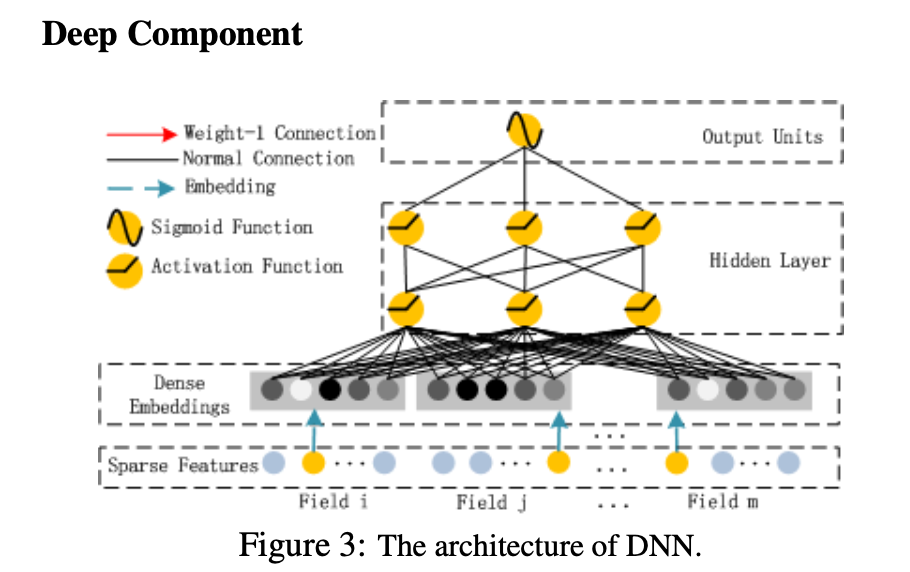

# CTR预估模型之DeepFM

2016年google推出了wide&deep模型之后，基本上就成为了各大推荐系统的标配。该模型既能学习到低阶的记忆性，又能学习到高阶部分的泛化性，所以整体效果来说是比较好的。

但是它有个麻烦的地方，那就是wide部分需要较多的特征工程工作。这一点对于人员紧张的小厂来说还是不太方便。而FM具有自动学习交叉特征的能力，同时其使用的隐变量也可以跟Deep部分一起共享。所以也就有了DeepFM这个模型，用FM来代替wide部分。

## FM 

详细介绍见[FM简介](./FM.md)

对比FM和Wide&Deep的Wide部分：

优点：

* 无需特征工程，这一点对于搭建端到端模型来说比较重要。
* 不要求交叉特征共同在样本出现过，使得在稀疏场景下也能学习到交叉特征

缺点：

* 可解释性不如wide
* 计算高阶交叉时需要对全员做交叉，wide则可以通过特征工程选择部分交叉特征

## DeepFM

尽管FM做了特征交叉，但是整体而言还是属于比较低阶的特征，模型学习到的主要还是特征共现性，即记忆特征。要想提高模型的泛化能力，还是需要加入Deep部分。

DeepFM论文中做了跟很多其他模型的对比，个人觉得比较有意义的就是和FM、wide&deep这两者的对比(其他模型感觉是拿来凑数的)。整篇文章凸显两个优势：

1. 端到端模型训练,无需特征工程和预训练
2. 同时捕捉到高阶和低阶特征

### FM Part

DeepFM的低阶部分由FM组成。论文的FM部分看起来像是个一层的神经网络，实际上$y_{FM}$还是用的FM传统的计算trick公式得到的.(注意到这层网络的名字叫FM Layer)

### Deep Part

DeepFM的高阶部分由MLP组成。假如我们有n个特征，隐变量为k维，则deep部分的输入即是把这n个k维的隐变量拼一起。$[V_1, V_2, ... V_n]$, 其中$V_i = [v_{i1}, v_{i2}, ... v_{ik}]$

### Combine

分别得到$y_{FM}$和$y_{DNN}$后，最终模型的输出为: $\hat{y} = sigmoid(y_{FM} + y_{DNN})$. 搭建模型的时候需要注意，k维的隐变量是FM和Deep一起共享的。

模型实现： [search-deeplearning/models/DeepFMEstimator](https://github.com/Genie-Liu/search-deeplearning/blob/master/search_deeplearning/models/DeepFMEstimator.py)

参考资料：
1. [Factorization Machines](https://www.csie.ntu.edu.tw/~b97053/paper/Rendle2010FM.pdf)
2. [DeepFM: A Factorization-Machine based Neural Network for CTR Prediction](https://arxiv.org/abs/1703.04247)
