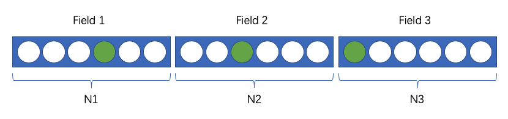
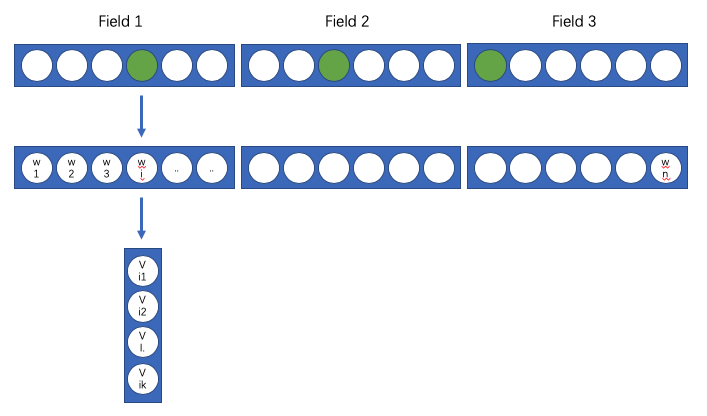
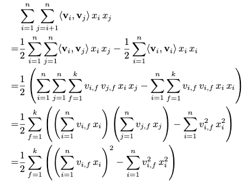
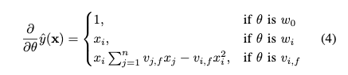

# Factorization Machines

在推荐场景中，我们经常面临稀疏的数据样本。SVM这种通用模型在稀疏场景下将失效，故论文提出了FM，这种能够在稀疏场景下有效的通用模型。论文最后也提到了FM与矩阵分解MF、SVD++等其他模型的关系，最后你会惊奇的发现FM模型是有多强大。

FM模型把稀疏特征映射为K维的隐变量，并且通过隐变量之间的点积来作为两个特征交叉的权重值.当然FM也可以做高阶的特征交叉，但是绝大部分时候我们还是只用二阶部分，更高阶的部分还是交给深度网络吧。

## FM模型结构

FM把每个稀疏特征作为一个field，每个field可能有多种取值。

如下图，我们有三个field，每个field分别有N1, N2, N3三种不同取值。

每个field的具体取值会对一个一个权重$w_i$以及一个隐变量$[v_{i1},v_{i2},...v_{ik}]$

最后模型的计算公式分为三部分: 偏置 + 一阶权重 + 二阶交叉权重：

## FM的计算Trick

FM通过使用特征隐变量来降低交叉特征需要训练的权重数量，只需要训练$K\*N$个隐变量参数。由于使用了隐变量，所以训练样本中不需要交叉特征同时出现也可以学习到他们之间的权重(论文中举例了电影推荐的场景, 很多时候未出现的交叉特征并不代表他们没有相关性).

尽管降低了参数量，但是二阶部分的计算复杂度为: $O(kn^2)$, 不同通过以下矩阵计算的转换，我们可以把计算复杂度降为$O(kn)$, 同时训练时候的SGD运算复杂度也降为$O(kn)$. 

## FM的特点

整体来看FM解决了以下问题：

1. 降低交叉特征所需要训练的权重数量。使用特征隐变量内积作为两个交叉特征的权重，隐变量的总参数为$K*N$

2. 降低交叉特征的计算复杂度, 从原来的$O(kn^2)$降低为$O(kn)$. 当然对于稀疏场景来说N不算太大. 这一操作使得在训练时候，SGD的运算复杂度也为O(K*N).
   
3. 解决从未出现过的交叉特征问题。

参考资料：
1. [Factorization Machines](https://www.csie.ntu.edu.tw/~b97053/paper/Rendle2010FM.pdf)
