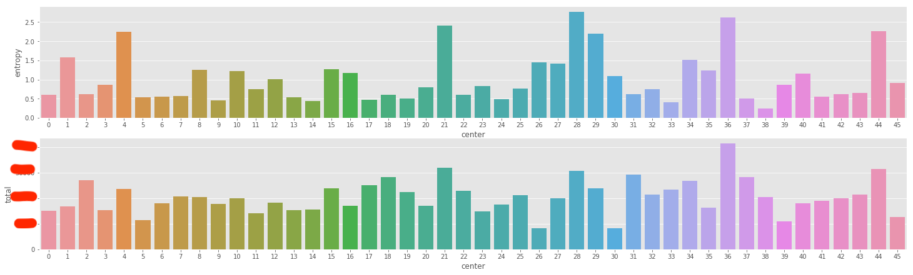

# 搜索排序实时个性化中的Embedding调研与实践

## 万物皆Embedding

最近在搜索场景中尝试做个性化召回部分的工作，经历了一番调研和实践之后，希望通过这篇博文来做个阶段性的总结和下一步工作的思考。

自从Tomas Mikolov的word2vec出来之后，相信只要做过文本处理的同学们都知道Embedding的概念，后来的Transformer和BERT无不在Embedding和Attention上做文章。近些年来，Embedding不止是在NLP届活跃，现在甚至有人提出“万物皆Embedding的概念”。具体说来就是借鉴NLP的文本上下文概念，构造出真实场景中的上下文，每个现实中的实体当作是文档中的单词，使用word2vec的方式，训练出实体的向量表达。

## Embedding在非NLP场景的应用

[Real-time Personalization using Embeddings for Search Ranking at Airbnb](https://dl.acm.org/doi/abs/10.1145/3219819.3219885) 是2018年KDD的最佳论文，该论文没有花哨的模型结构，而是使用了传统的word2vec的模型，通过对细节的调整处理来适应真实的应用场景。可以这么说，该论文的价值不在于模型的创新，而是工程化实践应用的细节处理。

接下来，让我们先简单过一下论文的一些要点：

1. 样本处理

    在airbnb场景中，同一个登录用户点击的房屋可以构造出点击序列。每个点击序列就相当于NLP中的文档，而其中的每个房源就是单词。在这些点击序中，文中做了两个小处理。

    * 过滤停留时间较短的房源
    * 两次点击间隔超过30min即归为不同点击Session

    

1. 使用skip-gram训练Embedding

    在多数的场景下，我们更经常能看到skip-gram模型，而不是cbow。在[论文]()中,我们看到两者的差别，skip-gram相较于cbow更能学习到语义上的信息。在我们非文本的场景里，语义对我们来说更为重要。

    

2. 下单商品作为全局上下文（Global Context）

    下单的商品在电商场景中是比较特殊的，但skip-gram是按照窗口大小来进行构造样本集，如果下单商品是最后点击的商品，那么该下单商品无法和前面的点击商品形成上下文，所以airbnb团队对原生的word2vec进行了修改，针对有下单的点击序，构造一个global context，使得点击商品的Embedding空间往最终下单商品靠近。
    

3. Embedding验证

    由于Embedding是从文本中通过无监督的方式（其实算是自动生成样本然后用有监督的方式做的）生成的，没有一套样本来对结果进行验证。在原始的word2vec论文里，作者是自己构建了文本单词对的数据集，然后进行验证的。而对于电商场景来说，这个验证就显得更为困难。

    该论文中，作者使用两种方式来对Embedding进行验证。
    1. 利用了房源的地理位置做直观的判断。首先对同一区域内（加州）的房源Embedding进行聚类，不同类别涂上不同颜色，然后在地图上展示。
    3. 构建小工具，通过单个房源获取余弦距离Top N小的其他房源，判断Embedding是否学到房屋风格等信息。
    2. 利用房屋的类型、价格等信息，对房源进行了分类，然后计算不同类别之间的Embedding的余弦距离。
    
    
    

这里我们过了一下listing Embedding部分的内容，实际上该论文还有做关于User Type Embedding和Listing Type Embedding的内容，这块后续尝试之后再跟大家分享。

## Embedding在CF的一些尝试

相关的代码后续整合到该[代码库](http://gitlab.yuceyi.com/search_algo/search-dataprepare)

1. 样本构建

    * 停留时间过滤这块没有做，一开始我以为没有包含用户在页面停留的时间。不过后来发现user_trace表内包含停留时间dur字段，后续可以基于该字段进行过滤；
    * 我这里也是用30min间隔作为click session的打断。这个参数的意义其实就是我们认为多久时间间隔的两次点击分属不同搜索（不同场景不同意图）

2. global context的实现

    作为该论文的亮点，global context的概念还是挺新鲜的。不过要实现这块功能，我们需要对源码进行修改。一看到word2vec的C++源码，相信别说改代码了，能看懂源码就已经要谢天谢地了。对此，我这边做了一个小trick，通过自己构造包含global contex的上下文的新样本来实现。具体就是保持原样本不动的情况下，拼接下单商品Lb和其他点击商品L1-Ln.

    当然这种构造虽然不用改动代码，但是为引入两个问题：

    1. 新增样本数据，导致在统计词频时改变了词频的分布。
    2. 由于训练过程中会进行负采样，单独构造的新样本，有可能负采样到同一窗口的其他商品（如下图，在训练L1 Lb时，有可能负采样到L1 L2）

    

3. 训练

    一开始我使用Spark的word2vec进行训练，一个月的数据量没有问题，但是数据量加大之后spark的运行时间变得很久，后来我这边就该用原生的word2vec进行训练。（Spark这块训练时间久的原因暂时未找到）

    虽然原生的word2vec使用单机训练，但是我这边4个月9千多万的click session训练10个epoch也只要一个多小时就搞掂了。

3. Embedding验证

    * 不同类目下Embedding的余弦相似度。相对于论文的cosine similarity，我们的结果偏低，但是类目之间的差异相对来说还是比较明显的。

    
    

    * 聚类后，同cluster下的类目信息熵。由于我们没有地理位置的信息，无法像论文那样给出直观的聚类结果评价。在这里我们聚类后，对同类别的商品类目进行分析，通过类目分布的信息熵来判断聚类效果。可以看到我们的类目信息熵普遍在1.5以下， 而原来所有商品的类目分布熵为2.6

    

虽然我们通过以上的流程训练得到了商品Embedding，但如何使用把Embedding用在搜索场景还需要继续探讨。初步想法是用faiss来做搜索的多路召回。

参考资料：
1. [Efficient Estimation of Word Representations in Vector Space](https://storage.googleapis.com/pub-tools-public-publication-data/pdf/41224.pdf)
2. [Real-time Personalization using Embeddings for Search Ranking at Airbnb](https://dl.acm.org/doi/abs/10.1145/3219819.3219885)

