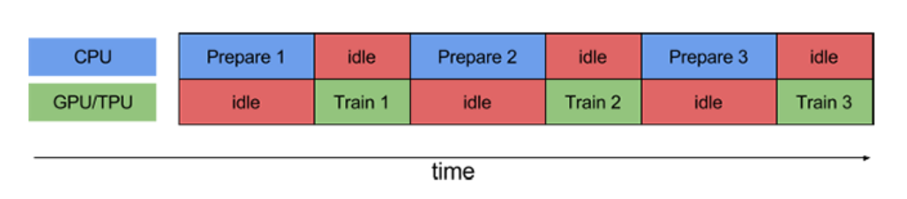
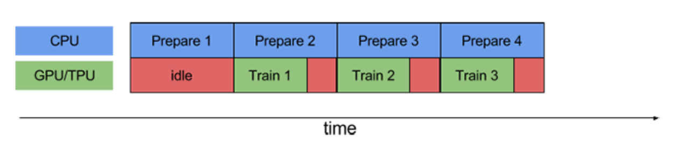
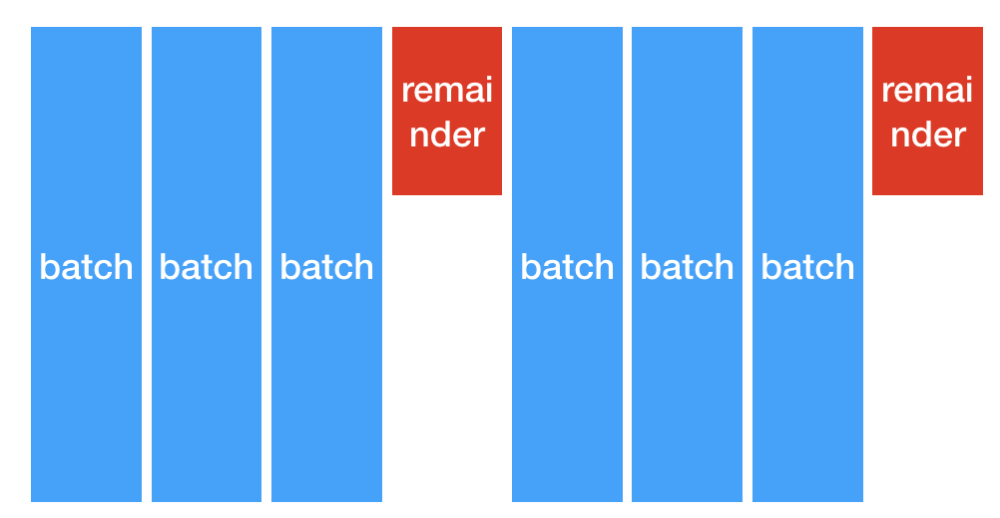
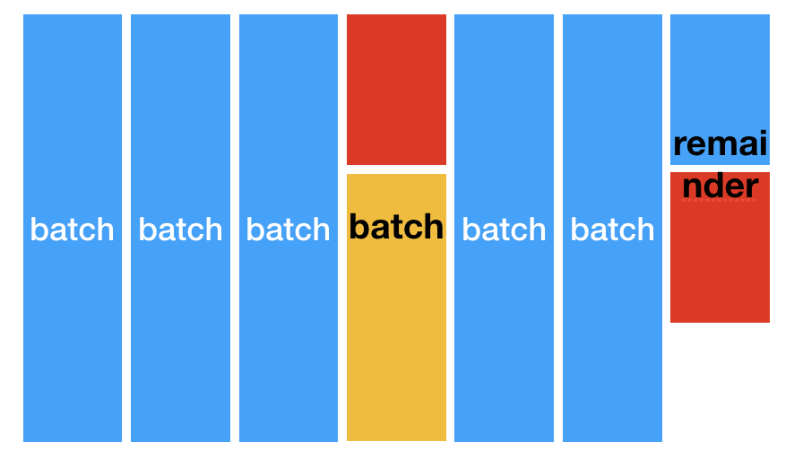
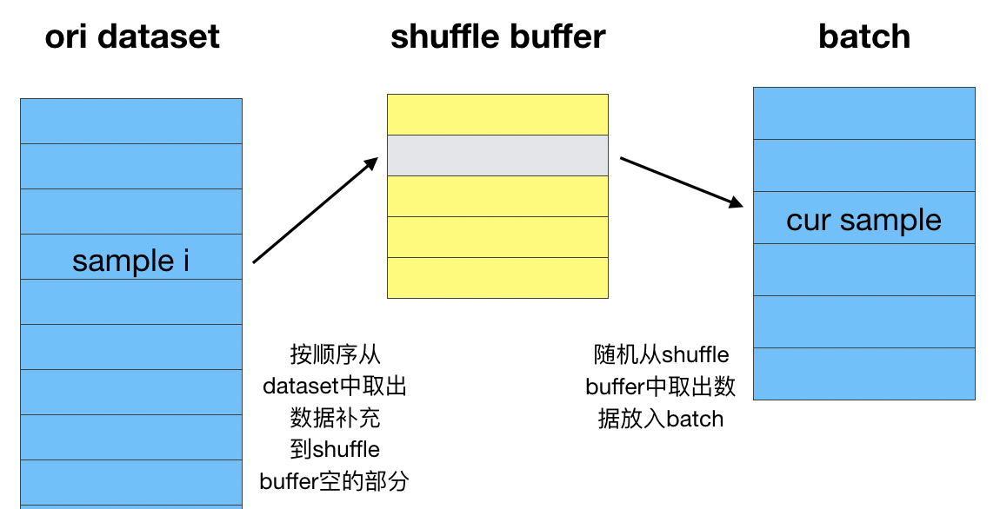

# Tensorflow之dataset介绍

虽然搭建模型是算法的主要工作，但在实际应用中我们花在数据处理的时间远比搭建模型的多。
而且每次由于数据格式不同，需要重复实现数据加载，构造batch以及shuffle等代码。

记得之前接触过的Pytorch、Paddle等框架都有dataset的工具，当然tensorflow也不例外，
经过一段时间的了解和实践，准备写下这篇博文来记录一下。

## TFrecord格式

Tensorflow支持多种输入格式，当然数据最后都会被处理成tensor。
其中tfrecord格式作为Tensorflow自家研制的数据格式(使用protocol buffer结构化数据存储格式)，
有着以下优点：

* 使用二进制格式存储，数据处理更加高效，占用空间更少；
* 支持多文件输入和懒加载，这一点对于大数据量和通过网络加载数据来说非常重要；
* Tensorflow提供TFRecordDaset API进行数据加载

有优点就有缺点，对于tfrecord来说，缺点就是其他数据类型都要经历转化成tfrecord这一过程，
并且不能直接查看数据内容（二进制的格式都有这个缺点）

tfrecord中的每一条样本叫做Example，其实就是对应protobuf中的message，格式是{"string": tf.train.Feature}映射。
其中Feature类型有三种取值([.proto file](https://github.com/tensorflow/tensorflow/blob/master/tensorflow/core/example/feature.proto)). 

1. tf.train.BytesList
2. tf.train.FloatList
3. tf.train.Int64List

支持类型看起来不多，实际上对于我们输入到模型的数据来说，已经是够用的了。

## 其他格式转化为Tfrecord

我们常用的格式大多是csv、json和libsvm，使用python的话，我们可以通过如下代码利用tf的api进行转化。

```python
import tensorflow as tf

out_file = "xxx"
label = 1
index = [1,2,3]
value = [0.5, 0.5, 0.5]
with tf.io.TFRecordWriter(out_file) as writer:
    feature = {
        'label':
            tf.train.Feature(int64_list=tf.train.Int64List(value=[label])),
        'index': tf.train.Feature(int64_list=tf.train.Int64List(value=index)),
        'value': tf.train.Feature(float_list=tf.train.FloatList(value=value)),
    }
    proto = tf.train.Example(features=tf.train.Features(feature=feature))
    writer.write(proto.SerializeToString())
```

但是这种方式可扩展性不强，效率较低。考虑到我们大多时候使用spark来处理数据，
这时可以使用[spark-tensorflow-connector](https://mvnrepository.com/artifact/org.tensorflow/spark-tensorflow-connector_2.11/1.13.1)这个依赖包把Dataframe保存成tfrecord格式。

以下是保存成tfrecord格式的代码，其实跟平时保存成parquet没啥差别。这里不但保存成tfrecord，
并且以gzip格式压缩。实际测试中，压缩率能达到25%，对于二进制格式文件来说，原本就没有可读性，
所以个人倾向对tfrecord文件进行压缩（spark保存成parquet，默认也用了snappy压缩）。

这次实践中出现一种情况，pom文件中加入spark-tensorflow-connector依赖打包成jar包，保存结果的tfrecord并没有被压缩。
而以`--jars spark-tensorflow-connector`的方式加入依赖则是正常的。后续有同学找到原因可以一起探讨一下。

```scala
df.select("label", "index", "value")
        .write.format("tfrecords")
        .option("recordType", "Example")
        .option("codec", "org.apache.hadoop.io.compress.GzipCodec")
        .mode("overwrite").save(outFilePath)
```

## TFrecord读取

一旦我们生成了tfrecord，首先需要验证一下数据是否如我们所期望的一致。用以下代码可以打印第一条数据内容：

```python
import tensorflow as tf

files = ["/path/to/tfrecord"]
tf.compat.v1.enable_eager_execution()
raw_dataset = tf.data.TFRecordDataset(files, compression_type="GZIP")

for raw_record in raw_dataset.take(1):
  example = tf.train.Example()
  example.ParseFromString(raw_record.numpy())
  print(example)
```

验证完了我们就可以把tfrecord文件加载成dataset, tfrecord支持多文件输入，所以传给dataset的是一个列表,
每个元素是文件路径名。Tensorflow支持从S3读取，这样我们只要用spark把数据保存到S3即可, S3文件名可以通过以下代码获取。

```python
def get_tfrecord_files(dir_list, sep=","):
  """
  Get tfrecord file list from directory
  """
  dirs = dir_list.strip().split(sep)
  rlt = []
  for dir_iter in dirs:
    files = tf.io.gfile.listdir(dir_iter)
    rlt.extend([
        os.path.join(dir_iter, f)
        for f in files
        if f.endswith(".tfrecord") or f.endswith(".gz")
    ])
  return rlt

files = get_tfrecord_files("/path/to/s3/dir/")
dataset = tf.data.TFRecordDataset(files, compression_type="GZIP")
```

此时，我们得到的dataset每一条数据还是序列化之后的Example数据，在实际应用中，需要对其进行解析。
解析时，我们需要构建一个feature_description，原因在于dataset使用graph-execution，所以需要
feature_description来确定Tensor的shape和类型。

```python
for raw_record in dataset.take(10):
  print(repr(raw_record))

# Create a description of the features.
feature_description = {
    'feature0': tf.io.FixedLenFeature([], tf.int64, default_value=0),
    'feature1': tf.io.FixedLenFeature([], tf.int64, default_value=0),
    'feature2': tf.io.FixedLenFeature([], tf.string, default_value=''),
    'feature3': tf.io.FixedLenFeature([], tf.float32, default_value=0.0),
}

def _parse_function(example_proto):
  # Parse the input `tf.Example` proto using the dictionary above.
  return tf.io.parse_single_example(example_proto, feature_description)

parsed_dataset = dataset.map(_parse_function)
```

## Dataset操作

推荐使用dataset API的原因在于，他提供了一套构建数据Pipeline的操作，包括以下三部分

1. 从数据源构造dataset（支持TFRecordDataset，TextLineDataset, CsvDataset等方式)
2. 数据处理操作 (通过map操作进行转化，tfrecord格式需要对Example进行解析)
3. 迭代数据 （包括batch, shuffle, repeat, cache等操作）

数据读取部分上面已经提过，只要传一个file list给TFRecordDataset即可。而数据处理这块，由于我们
喂入的数据都是处理好的了，只要写一个example的解析函数即可（对于图像数据则可能还会涉及到裁剪、变形等操作）。
接下来就是一些dataset常见的操作了.

这里涉及到dataset的操作顺序和一些参数调优的问题：

1. map可以通过num_parallel_calls参数实现并行化，提高数据转化效率
2. prefetch能够实现数据加载和模型训练并行效果，充分利用cpu和gpu资源

    <p></p>
    <p></p>

3. batch, shuffle, repeat这三者的顺序不同，结果也会不一样。具体可以运行下面代码并调整三者顺序来验证.

    ```python
    import tensorflow as tf
    tf.compat.v1.enable_eager_execution()
    dataset = tf.data.Dataset.from_tensor_slices(list(range(0, 10)))
    dataset = dataset.batch(3, drop_remainder=False)
    dataset = dataset.repeat(2)
    dataset = dataset.shuffle(4)
    ```

    先batch再repeat
    <p></p>

    先repeat再batch
    <p></p>

    shuffle机制，若先做batch再shuffle，则shuffle的是各个batch，而不是batch里的样本。
    <p></p>


参考资料
1. [Tensorflow Records? What they are and how to use them](https://medium.com/mostly-ai/tensorflow-records-what-they-are-and-how-to-use-them-c46bc4bbb564)
2. [Google Protocol Buffer 的使用和原理](https://www.ibm.com/developerworks/cn/linux/l-cn-gpb/index.html)
3. [TFRecord and tf.Example](https://www.tensorflow.org/tutorials/load_data/tfrecord)
4. [tensorflow:input pipeline性能指南](http://d0evi1.com/tensorflow/datasets_performance/)